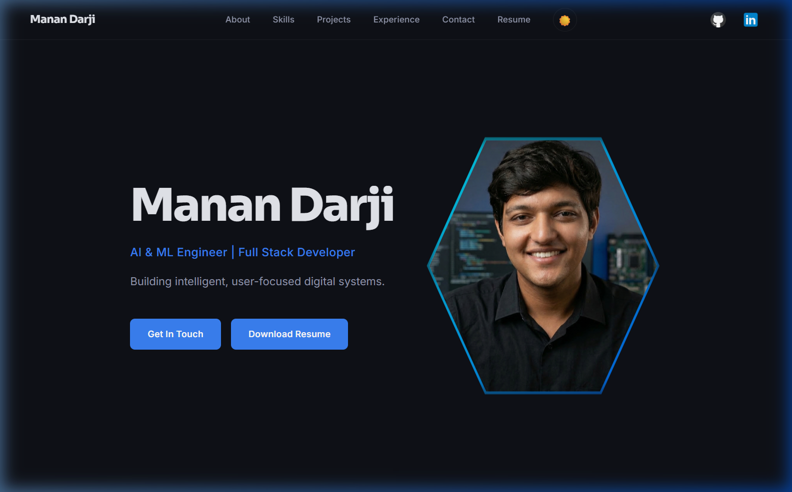

# Manan Darji Portfolio

A modern, responsive personal developer portfolio showcasing my projects, skills, and experience as an AI/ML Engineer and Full Stack Developer.

---

## About
This project serves as a comprehensive digital resume and interactive showcase. It highlights my journey in software engineering, demonstrating both my technical depth in backend AI logic and my commitment to creating engaging user interfaces.



## Features
- **Responsive Design**: Flawlessly adapts across desktop, tablet, and mobile devices.
- **Hero Section**: Features an interactive layout with a modern, floating glowing hexagon developer portrait.
- **Skills Showcase**: Categorized tech stack grid for programming, web, data science, and tools.
- **Projects Gallery**: Detailed project cards with technology tags and direct repository links.
- **Experience Timeline**: Professional timeline mapping my teaching and professional journey.
- **Interactive Contact Section**: Functional contact form powered by a localized backend setup.
- **Resume Download**: Direct access to my latest professional resume.

## Tech Stack
- **HTML5**: Semantic and accessible document structure.
- **CSS3**: Custom design tokens, CSS Grid/Flexbox layouts, bespoke media queries, and smooth animations (no external CSS frameworks used).
- **JavaScript (ES6+)**: Custom intersection observers for scroll animations and dynamic mobile navigation logic.

## Project Structure
```
├── index.html        # Main entry point structure
├── styles/           # Modular CSS files
│   ├── design-tokens.css # Global variables & themes
│   ├── responsive.css    # Responsive mobile utilities
│   ├── hero.css          # Hero section styling
│   └── ...               # Component-specific styles
├── assets/           # Static assets, images, & resume
├── backend/          # Flask Python server configuration
└── script.js         # Interactive DOM logic & animations
```

## Deployment

The portfolio is deployed using a modern full-stack architecture.

### Frontend
The frontend (HTML, CSS, JavaScript) is deployed using **Vercel**.

Vercel automatically builds and deploys the site whenever changes are pushed to the GitHub repository.

Live Site:
https://manan-darji-portfolio.vercel.app


### Backend
The Flask backend used for processing the contact form is deployed using **Render**.

The backend exposes an API endpoint that the frontend communicates with to handle form submissions.

Example API endpoint:
https://portfolio-website-n29f.onrender.com/contact


### Deployment Workflow

1. Push changes to the GitHub repository
2. Vercel automatically redeploys the frontend
3. Render runs the Flask backend service
4. The frontend communicates with the backend API

## Author

**Manan Darji**  
*AI/ML Engineer | Full Stack Developer*  
[GitHub](https://github.com/MananDarji06) | [LinkedIn](https://www.linkedin.com/in/manan-darji-573a87359/)
